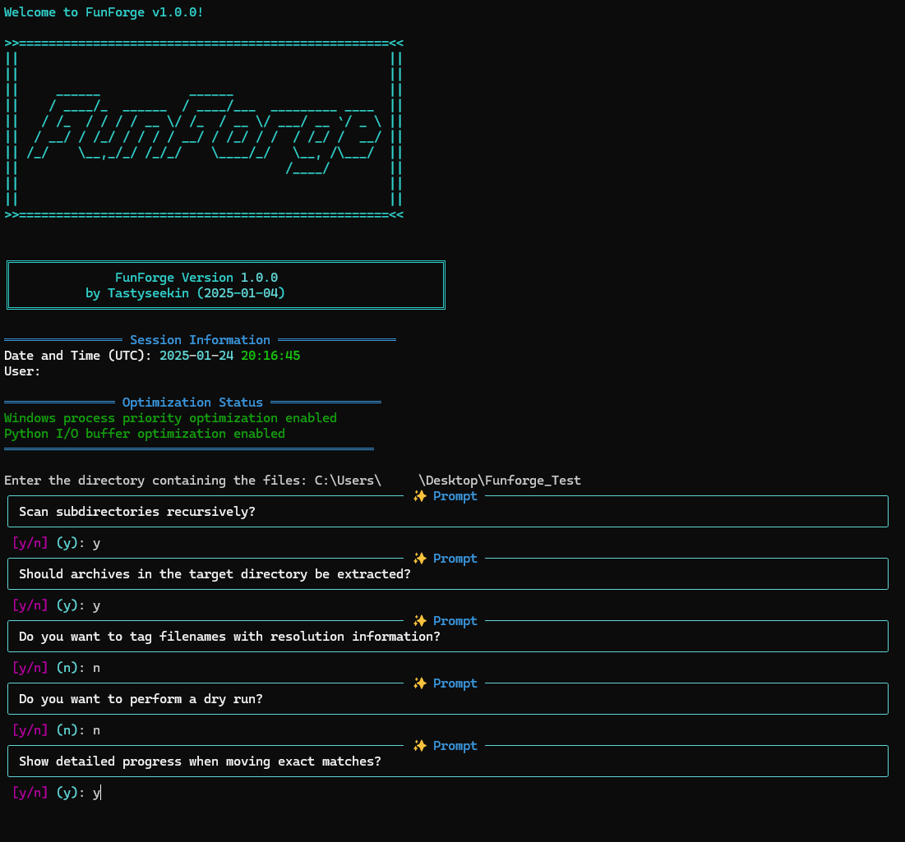
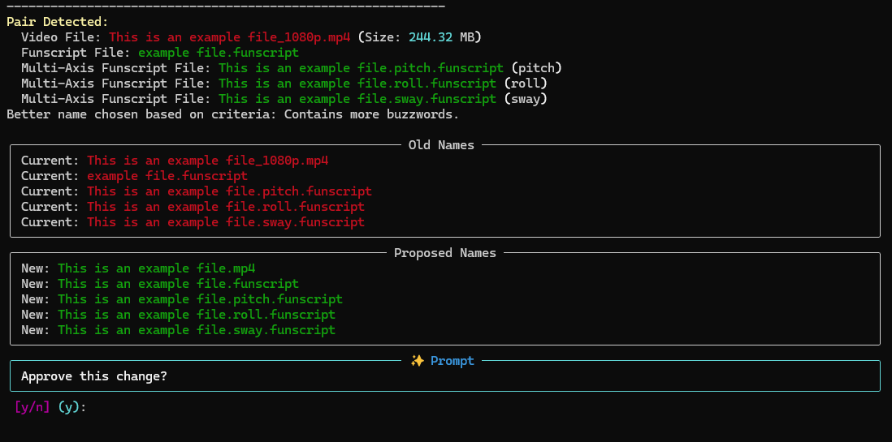

<div align="center">
  
  <br><br>
  
  
  
  
</div>

A powerful CLI Python tool for forging perfect matches between video files and their associated funscripts, with smart organization, performance optimization, and renaming capabilities.

## ⚠️ Important Note
While the tool supports password-protected archives, the extraction process for these can be significantly slower due to the decryption overhead. For better performance, it is recommended to extract password-protected archives manually.

## Features

- 🎯 Smart matching between video files and their corresponding funscripts/subtitles
- 📦 High-performance archive extraction with real-time progress
- 🔐 Password-protected archive support (though manual extraction recommended)
- 🔍 Fuzzy matching algorithm for similar filenames
- 📺 Video resolution detection and tagging
- 🗂️ Multi-axis funscript support
- 🔄 Recursive directory scanning
- 📝 Subtitle file handling
- ⚡ Optimized thread-pooled operations
- 🖥️ Rich CLI interface with detailed progress tracking
- 🚀 System performance optimization
- 🧪 Dry-run mode for testing
- 🗑️ Automatic cleanup of empty folders after file operations

## Directory Structure

The script creates the following directory structure:
```
YourDirectory/
├── FunForge/
│   ├── Already Same Name/  # Files with exact matches
│   ├── Changed/           # Successfully renamed files
│   └── Not Changed/       # Files without matches
```
## Screenshots
<div align="left">
  
  <br>
  
</div>

## Name Lists Setup (Important!)

The script uses three name list files (`names_1.txt`, `names_2.txt`, and `names_3.txt`) to improve its matching accuracy. While the script will work without these files, having them significantly improves the accuracy of file matching and renaming.

### Why Name Lists Matter
- Provides reference patterns for matching
- Improves accuracy of fuzzy matching
- Helps identify common naming conventions
- Enhances the script's ability to choose better names

### Getting Name Lists

Since we can't distribute personal name lists on GitHub due to content policies, you have two options:

#### Option 1: Find existing name lists
- Visit the lagrest funscript Forum
- Search for posts containing reference FunForge
- Look for the post with shared name lists

#### Option 2: Create Your Own Name Lists
If you have a very large existing collection of properly named files:

1. Open Command Prompt in your main funscript directory
2. Generate a list of filenames:
   
On Windows:
   ```
dir /b > filenames.txt
```
On Linux:
```
ls > filenames.txt
````
   
3. Split the resulting `filenames.txt` into three roughly equal parts
4. Name them as:
   - `names_1.txt`
   - `names_2.txt`
   - `names_3.txt`
5. Place these files in the same directory as the script

### File Placement
Place the three name list files in the same directory as the script:
```
FunForge/
├── funforge.py
├── names_1.txt
├── names_2.txt
├── names_3.txt
└── ...
```

### Note About Name Lists
- The script will still function without these files
- Matching accuracy will be reduced without name lists
- You can update the lists over time to improve matching
- Each list can contain different naming patterns


## Installation

### Windows
1. Make sure [Python 3.8 or later](https://www.python.org/downloads/) is installed `Check the box that says "Add Python to PATH" before proceeding.`
2. Make sure pip is up to date `python -m pip install --upgrade pip`
3. Install the newest version of 7Zip or WinRaR
4. Download and extract this repository
6. Run `pip install -r requirements.txt`
7. Run the Script `python funforge.py`

### Required System Components
The installer will check for these and provide download links if missing:
- [MediaInfo](https://mediaarea.net/en/MediaInfo/Download/Windows)
- [7-Zip](https://www.7-zip.org/) or [WinRAR](https://www.win-rar.com/)

### Dependencies
```bash
rich>=13.0.0
rarfile>=4.0
pymediainfo>=5.1.0
rapidfuzz>=2.13.7
pathlib>=1.0.1
psutil>=5.9.0
python-magic>=0.4.27
tqdm>=4.65.0
```

## Usage

Run the script:
```bash
python funforge.py
```

Follow the interactive prompts to:
1. Enter the target directory path
2. Choose whether to scan subdirectories recursively
3. Choose whether to extract archives
4. Enable/disable resolution tagging
5. Enable/disable dry-run mode
6. Enable/disable automatic cleanup of empty folders

### Archive Handling Recommendations
- For optimal performance, extract password-protected archives manually before using the tool
- Use the tool's archive handling primarily for unprotected archives
- If you must process password-protected archives with the tool, expect longer processing times

## Performance Optimizations

The script includes several performance enhancements:
- Process priority optimization for faster execution
- Increased I/O buffer sizes for better file handling
- Optimized archive extraction with larger chunk sizes
- Multi-threaded operations for parallel processing
- Real-time progress tracking for large archives

## Configuration

The script uses several configurable parameters:

- `FUZZ_THRESHOLD`: Minimum similarity score for fuzzy matching (default: 45)
- `CHUNK_SIZE`: Size of chunks for file operations (default: 1MB)
- `BUFFER_SIZE`: Buffer size for file operations (default: 8MB)
- `ARCHIVE_EXTENSIONS`: Supported archive formats (default: [".zip", ".rar"])
- `VIDEO_EXTENSIONS`: Supported video formats
- `MULTI_AXIS_EXTENSIONS`: Supported funscript axis extensions
- `SUBTITLE_EXTENSIONS`: Supported subtitle formats
- `BUZZWORDS`: Keywords used for name quality assessment

## Features in Detail

### Smart Matching
- Uses RapidFuzz for intelligent filename matching
- Considers file content and naming patterns
- Handles multi-axis funscripts appropriately

### Archive Handling
- High-performance extraction of regular archives
- Support for password-protected archives (though slower)
- Real-time progress tracking with detailed statistics
- Automatic cleanup after successful processing

### File Organization
- Organizes files into categorized directories
- Preserves original files until successful matching
- Handles duplicate files safely
- Improved error handling and recovery
- Automatic cleanup of empty folders after moving files
- Interactive confirmation for folder deletion

### System Optimization
- Automatic process priority adjustment
- Optimized I/O operations
- Memory usage optimization
- Multi-threaded processing

## Known Limitations
1. Password-protected archive extraction is significantly slower due to encryption overhead
2. Large password-protected archives may take considerable time to process
3. Memory usage may increase when handling large encrypted archives

## Troubleshooting

If you encounter any issues:
2. Ensure all system requirements are installed
3. Check your Python version (3.8+ required)
4. For slow password-protected archives:
   - Extract them manually before using the tool
   - Use smaller archives
   - Split large archives into smaller parts
5. Verify system optimization support:
   ```bash
   python -c "import psutil; print('System optimization available')"
   ```
6. Check MediaInfo and archive tool installation

## License

This project is licensed under the MIT License - see the LICENSE file for details.

## Acknowledgments

- [Rich](https://github.com/Textualize/rich) for beautiful terminal output
- [RapidFuzz](https://github.com/maxbachmann/RapidFuzz) for fuzzy string matching
- [PyMediaInfo](https://github.com/sbraz/pymediainfo) for media file analysis

## Author

**tastyseekin** - [GitHub Profile](https://github.com/tastyseekin)

Last Updated: 2025-01-25 14:15:52 UTC
